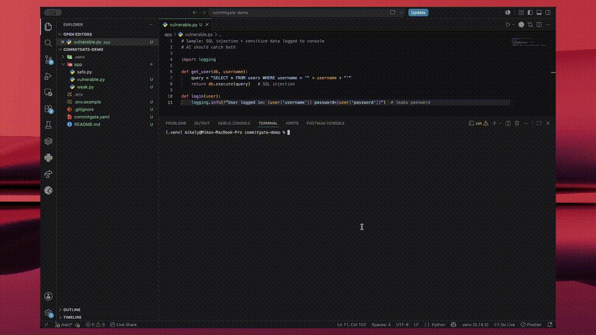

# CommitGate

An AI-powered security gate for Git. On every `git commit` or every `git push`, CommitGate scans your changes and **blocks them** before secrets or risky code ever reach your history.

---

## Demo



*CommitGate blocking a vulnerable commit before it reaches Git history.*

---

## The scanners

CommitGate runs two scanners over your changes and merges their findings:

| Scanner | Catches |
|---------|---------|
| [![Gitleaks][gitleaks-badge]][gitleaks-link] | Known secret shapes — API keys, tokens, passwords that match standard patterns |
| **AI Reviewer** | What regex missed — code understanding, private knowledge & data |

---

## Available Providers

These are the available providers that we support for the AI reviewer. You can choose between use an OpenAI-compatible API key (recommended) or use your own AI agent (Claude or Codex).

| Type | Providers |
|------|-----------|
| **OpenAI-compatible API** (needs an API key) | [![OpenAI][openai-badge]][openai-link] [![Gemini][gemini-badge]][gemini-link] [![DeepSeek][deepseek-badge]][deepseek-link] [![Groq][groq-badge]][groq-link] |
| **AI Agents** (no API key — uses your local login) | [![Claude Code][claude-badge]][claude-link] [![Codex][codex-badge]][codex-link] |

---

## How it works

1. You run `git commit` (or `git push`). The installed Git hook hands your changes to CommitGate.
2. Two scanners run over the diff — **Gitleaks** (known secret patterns) and the **AI Reviewer** (everything else).
3. The **decision engine** merges the findings and rules **allow**, **warn**, or **block**.
4. You get a report in your terminal. On **block**, the commit or push is stopped; otherwise it proceeds.

See [`docs/architecture.md`](docs/architecture.md) for the module-by-module design.

---

## Setup

### 1. Install the prerequisites

| Requirement | How to install |
|-------------|----------------|
| **Python ≥ 3.10** | [python.org](https://www.python.org/downloads/) |
| **Git** | [git-scm.com](https://git-scm.com/downloads) |
| **Gitleaks** (separate binary, *not* installed by `pip`) | See installation instructions below. |

#### Installing Gitleaks

- **Windows**
  ```powershell
  winget install gitleaks
  ```

- **macOS**
  ```bash
  brew install gitleaks
  ```

- **Linux**
  - Download the latest release from the
    [Gitleaks Releases](https://github.com/gitleaks/gitleaks/releases)
  - Place the binary somewhere on your `PATH`

- For additional installation methods (Snap, Docker, package managers, etc.), see the official [Gitleaks installation guide](https://github.com/gitleaks/gitleaks#installing).

Confirm Gitleaks is ready:

```bash
gitleaks version
```

### 2. Install CommitGate

```bash
pip install git+https://github.com/ductrl/CommitGate.git
```

### 3. Protect your repo

Run this **inside the repo you want to guard**:

```bash
commitgate init
```

This creates a `commitgate.yaml` config file and installs a Git hook. It asks whether you want a **pre-commit** or **pre-push** hook — see [How to use](#how-to-use).

### 4. Set up the AI Reviewer

Open `commitgate.yaml` and set `provider` to match one of the paths below.

**Option A — API key** (OpenAI · Gemini · DeepSeek · Groq)

```yaml
ai:
  provider: groq        # or openai / gemini / deepseek
```

Create a `.env` file in your project root and add your key (Groq keys are **free** at [console.groq.com](https://console.groq.com)):

```env
AI_KEY=your-api-key-here
```

Keep `.env` out of Git — it holds your key.

**Option B — AI Agent** (Claude Code or Codex, no API key)

First confirm the agent is installed and logged in:

```bash
claude --version    # Claude Code
codex --version     # Codex
```

Then set the provider:

```yaml
ai:
  provider: claude-cli   # or codex-cli
```

**Option C — No AI** (Gitleaks only)

```yaml
ai:
  enabled: false
```

It is recommended to commit `commitgate.yaml` so your whole team shares the same gate policy. The file doesn't and shouldn't include any secrets.

---

## How to use

After `commitgate init`, just `git commit` / `git push` as usual — CommitGate runs automatically.

### pre-commit vs pre-push

You pick one when you run `commitgate init` (or `commitgate install-hook`):

| Hook | Runs on | Scans |
|------|---------|-------|
| **pre-commit** | every `git commit` | your staged changes — fast, per-commit feedback |
| **pre-push** | every `git push` | every commit in the push range — a final gate before code leaves your machine |

To switch, or add the other one later, run `commitgate install-hook` and choose. Install both for defense in depth.

### What each outcome means

| Outcome | When |
|---------|------|
| `allow` | no findings |
| `warn` | findings **below** the block severity |
| `block` | findings **at or above** the block severity (default: `high`) |

Change the bar with `policy.block_severity` in `commitgate.yaml` (`low` / `medium` / `high` / `critical`). See [Configuration](#configuration) for that and every other knob.

### Scan manually

Check your staged changes any time, without committing:

```bash
git add app.py
commitgate scan
```

If `app.py` hardcodes a secret, you'll see:

```
CommitGate detected 1 security finding(s):
[CRITICAL] Finding #1
	- Source: gitleaks
	- Category: Secret leak
	- Severity: critical
	- File: app.py
	- Location: Line 12 to 12
	- Description: AWS Access Key detected
Commit blocked by CommitGate.
```

### Skip once

Need to bypass the gate for a single commit:

```bash
SKIP=commitgate git commit -m "your message"
```

---

## Configuration

`commitgate init` writes a `commitgate.yaml` in your repo root. Every option has a safe default — edit only what you need. To restore the file to defaults at any time:

```bash
commitgate reset-config
```

The full file, annotated:

```yaml
# Enable or disable CommitGate for this repository.
enabled: true

ai:
  # Enable the AI Reviewer (Gitleaks still runs when false).
  enabled: true

  # AI provider — see "Set up the AI Reviewer" above.
  #   API key:  openai, deepseek, gemini, groq
  #   AI agent: claude-cli, codex-cli
  provider: deepseek

  # Max seconds for AI review; on timeout the deterministic gate continues.
  timeout: 20

policy:
  # Findings at or above this severity block the commit/push.
  # Options: low, medium, high, critical
  block_severity: high

reporting:
  # Minimum severity shown in output. Findings below it are hidden.
  # Must be <= block_severity, so a blocking finding is never hidden.
  # Options: low, medium, high, critical
  min_severity: low

  # Show or hide individual fields on each finding in the report.
  fields:
    source: true
    category: true
    description: true
    suggestions: true
```

| Option | Default | What it does |
|--------|---------|--------------|
| `enabled` | `true` | Master switch — `false` turns CommitGate off for this repo (the hook exits `0` without scanning). |
| `ai.enabled` | `true` | `false` runs Gitleaks only — no diff leaves your machine. |
| `ai.provider` | `deepseek` | Which AI reviewer to use — see [Set up the AI Reviewer](#4-set-up-the-ai-reviewer). |
| `ai.timeout` | `20` | Seconds allowed for AI review; on timeout the deterministic gate still runs. |
| `policy.block_severity` | `high` | Findings at or above this severity **block**; below it **warn**. |
| `reporting.min_severity` | `low` | Hides findings below this severity from the report. Capped at `block_severity`. |

---

## Data Privacy

When the AI Reviewer is enabled, CommitGate sends your **staged code diffs to the AI provider you configure** in `commitgate.yaml`. This applies to the AI Agents too (Claude Code → Anthropic, Codex → OpenAI), as your diff is still sent to their provider, so they are *not* air-gapped options.

**Do not** use the AI Reviewer on confidential or proprietary code without your organization's authorization. Set `ai.enabled: false` to run Gitleaks only. 

**Fully local LLM support is on the roadmap.**

---

## Splunk Audit Logging (optional)

CommitGate can send an audit event to Splunk after every scan, giving you a searchable history of every commit decision.

### 1. Create a Splunk account

Sign up at `splunk.com`. Start a **Splunk Cloud free trial** from your account dashboard.

### 2. Enable HTTP Event Collector (HEC)

In your Splunk UI:

1. **Settings** → **Data Inputs** → **HTTP Event Collector**
2. Click **Global Settings** → set **All Tokens** to **Enabled** → **Save**

### 3. Create a HEC token

1. Still on the HTTP Event Collector page → **New Token**
2. **Name:** `commitgate-audit`
3. Click **Next** → **Source type:** type `commitgate:audit` and select **New**
4. **Index:** `main` → **Review** → **Submit**
5. Copy the token shown on the confirmation screen

### 4. Add to your `.env`

```env
SPLUNK_HEC_TOKEN=your-token-here
SPLUNK_HEC_URL=https://prd-p-yourinstance.splunkcloud.com:8088/services/collector/event
SPLUNK_VERIFY_SSL=false
```

> **Why `SPLUNK_VERIFY_SSL=false`?** Splunk Cloud free trial issues certificates missing the Authority Key Identifier extension required by Python 3.10+, making SSL verification impossible on the free plan. Paid Splunk accounts use properly signed certificates and do not need this setting.

### 5. Verify the connection

Stage any file and run a manual scan:

```bash
git add <any-staged-file>
commitgate scan
git restore --staged <any-staged-file>
```

If the audit event reaches Splunk you'll see no yellow "Splunk audit log failed" warning in the output.

### 6. View events in Splunk

**Search & Reporting** → run:

```
sourcetype="commitgate:audit"
```

Each `commitgate scan` appears as one event with `action`, `reason`, `findings_count`, and the full findings list.

### Splunk dashboard

Build a **CommitGate Security Gate** dashboard with these searches:

| Panel | Type | Search |
|-------|------|--------|
| Decisions over time | Line chart | `sourcetype="commitgate:audit" action!="allow" \| timechart count by action` |
| Blocks today | Single value | `sourcetype="commitgate:audit" action=block \| stats count as Blocked` |
| Top triggered categories | Bar chart | `sourcetype="commitgate:audit" \| stats count by findings{}.category \| sort -count` |
| Findings by severity | Pie chart | `sourcetype="commitgate:audit" \| stats count by findings{}.severity` |
| Recent blocked commits | Table | `sourcetype="commitgate:audit" \| table _time reason findings_count \| sort -_time` |

---

## License

[MIT](LICENSE) © 2026 Mike Ly

CommitGate is free to use, modify, and distribute under the terms of the MIT License.

<!-- provider badge + link definitions -->
[openai-badge]: assets/badges/openai.svg
[gemini-badge]: https://img.shields.io/badge/Gemini-8E75B2?logo=googlegemini&logoColor=white
[deepseek-badge]: https://img.shields.io/badge/DeepSeek-4D6BFE?logo=deepseek&logoColor=white
[groq-badge]: assets/badges/groq.svg
[claude-badge]: https://img.shields.io/badge/Claude_Code-C15F3C?logo=claude&logoColor=white
[codex-badge]: assets/badges/codex.svg
[openai-link]: https://platform.openai.com
[gemini-link]: https://aistudio.google.com/
[deepseek-link]: https://platform.deepseek.com
[groq-link]: https://console.groq.com
[claude-link]: https://www.anthropic.com/claude-code
[codex-link]: https://openai.com/codex/
[gitleaks-badge]: assets/badges/gitleaks.svg
[gitleaks-link]: https://gitleaks.org/
